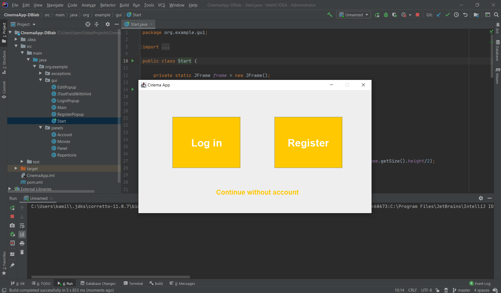

# Cinema App
Java desktop aplication created for University project. 

## Functionalitie

The goal of this exercise was to create and connect to MySQL database. This aplications allows three types of users (without account, with account, and administartor) and specific permisions based on account type.
Basic user could only see a repertoire (movies, where are they played and when, actor crew, etc.) and create an account.
Logged in user could additionally book a seat on some movie.
Admin had the ability to remove users, add and remove movies, cinemas, etc.

